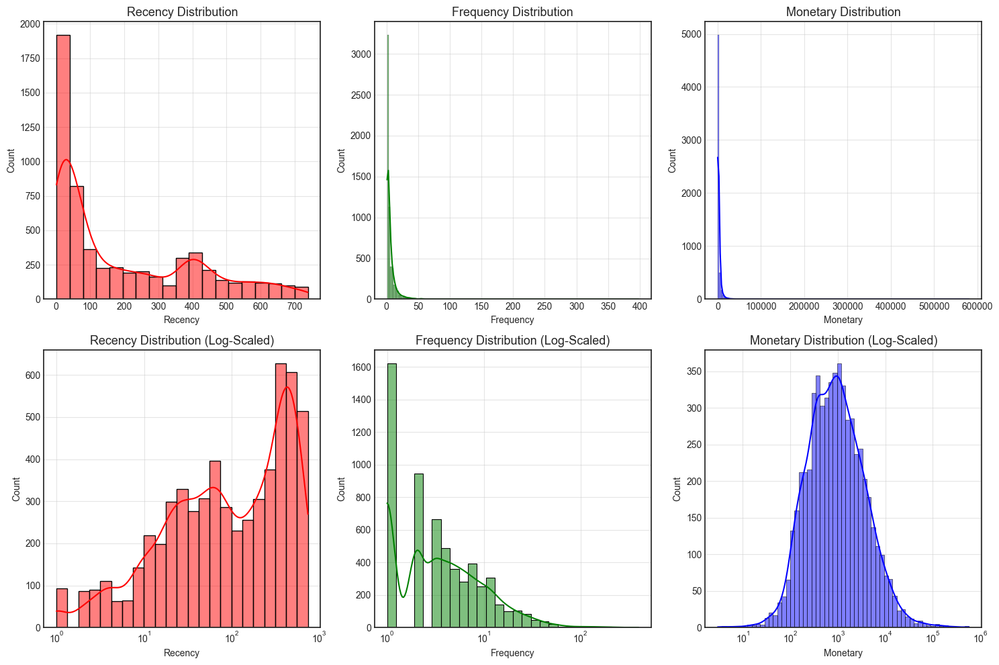
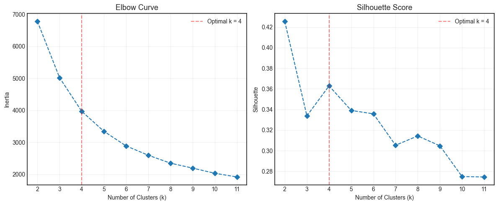
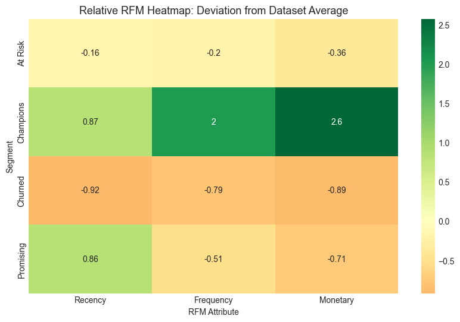
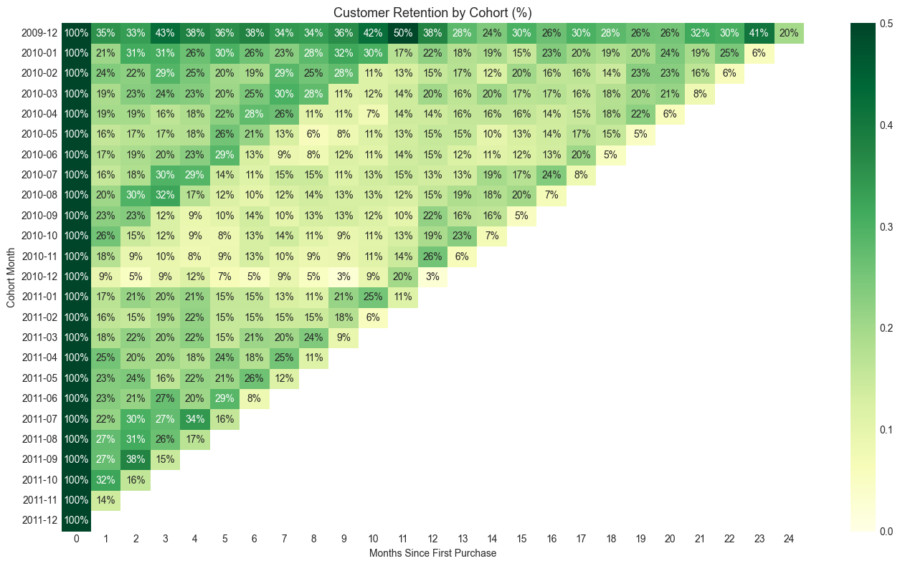

# 📊 Customer Segmentation with RFM & K-Means

## Introduction & Data Dictionary

The dataset captures 1,067,371 e-commerce transactions over two years (Dec 2009 - Dec 2011) for a UK-based online retailer.

| Feature | Type | Description |
| :--- | :--- | :--- |
| `Invoice` | Nominal | 6-digit transaction ID. 'C' prefix = cancellation |
| `StockCode` | Nominal | 5-digit product ID |
| `Description` | Nominal | Product name |
| `Quantity` | Numeric | Units purchased per transaction |
| `InvoiceDate` | DateTime | Transaction timestamp |
| `Price` | Numeric | Price per unit (£) |
| `Customer ID` | Nominal | 5-digit customer ID |
| `Country` | Nominal | Customer country |

---

## 🎯 Objectives

This project uses RFM analysis, K-Means clustering, and Cohort Analysis to segment customers and track retention dynamics on the Online Retail II dataset.

1. **Engineer RFM Profiles:** Calculate customer-level Recency, Frequency, and Monetary (RFM) metrics from raw sales logs.
2. **Segment Customers via Machine Learning:** Deploy a K-Means clustering algorithm backed by the Elbow Method and Silhouette Analysis to group similar purchasing behaviors and ensure distinct, optimal clusters.
3. **Cluster Profiling & Business Interpretation:** Analyze and interpret the resulting segments using both absolute metrics and Relative Importance Segment Attributes (RISA) for business actions.
4. **Track Retention Dynamics:** Evaluate long-term customer loyalty and purchasing trends over time using cohort matrices (Retention Heatmap).

---

## 🏗️ Data Processing & Wrangling

| Step | Action |
|:---|:---|
| Hygiene | Cleaned column names |
| Missing | Dropped null Customer IDs; filled descriptions with 'unknown' |
| Duplicates | Removed duplicate rows |
| Anomalies | Removed cancelled orders (prefix 'C'), negative qty/price |
| Features | Created `TotalPrice = Quantity × Price` |

---

## 📊 Visualizations

### RFM Distributions



*Log transformed + Standardized (mean=0, std=1)*

### KMeans Clustering

**Optimal Clusters:** Elbow method + Silhouette score for k=2 to 12. Optimal k where inertia slows and silhouette peaks.



**Result:** Optimal clusters = 4

### RFM Segments

**Legend:** Recency (days since purchase), Frequency (purchase count), Monetary (total spend in £). K-Means on standardized scores.

| Segment | Recency | Frequency | Monetary | Strategy |
|:---:|:---:|:---:|:---:|:---|
| **Champions** | 27 days | 18.9 | £10,565 | Exclusive rewards |
| **Promising** | 28 days | 3.1 | £844 | Marketing campaigns |
| **At Risk** | 234 days | 5.1 | £1,897 | Win-back discounts |
| **Churned** | 386 days | 1.3 | £317 | Low-cost re-engagement |



### Cohort Analysis

| Finding | Action |
|:---|:---|
| **78.83% Month 1 Churn** | Low-cost re-engagement |
| **Dec 2009 strongest** | Exclusive rewards |
| **19.69% survive 24 months** | Loyalty programs |
| **Dec 2010 weakest** | Post-Christmas win-back |



---

## 📥 Installation

```bash
git clone https://github.com/aguchhait-stack/Online_Retail_II.git
cd Online_Retail_II
pip install -r requirements.txt
jupyter notebook online_retail_uci.ipynb
```
---

## 📄 License & Citation

**Dataset Citation:**  
Chen, D. (2012). *Online Retail II* [Dataset]. UCI Machine Learning Repository. https://doi.org/10.24432/C5CG6D

**Dataset License:** Creative Commons Attribution 4.0 International (CC BY 4.0)